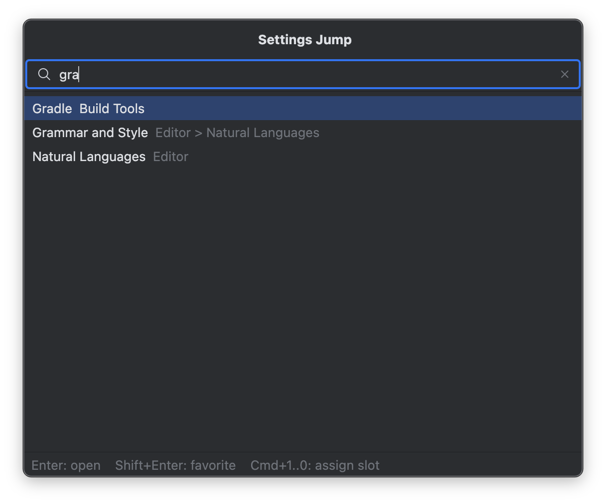
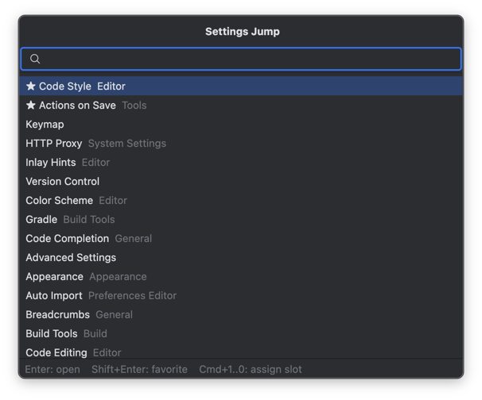
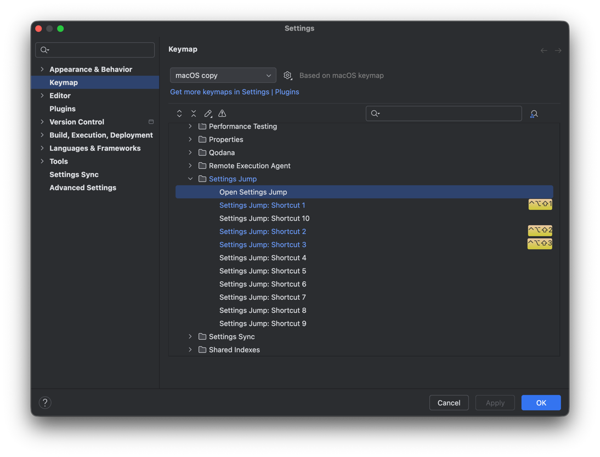

# Settings Jump

Fast navigation to JetBrains IDE settings pages. Search a page by name, mark it
as a favorite, or bind it to a shortcut and open it with a single keystroke —
without walking the settings tree every time.

Settings Jump never changes setting values. It only takes you to the page;
editing stays in the IDE's own Settings dialog.




## Features

- **Search** settings pages by display name, hierarchy path, or internal id
  (English queries like `gradle` also work on localized IDEs).
- **Open directly**: the Settings dialog opens with the target page selected.
- **Favorites**: starred pages appear first when the popup opens.
- **Shortcut slots**: assign a page to one of ten fixed slots
  (`Settings Jump: Shortcut 1..10`), bind keys in Keymap, and open the page
  with one keystroke.
- **Recent**: pages opened through Settings Jump are one keystroke away.
- **Fail closed**: if a page's plugin is uninstalled or disabled, nothing
  breaks — favorites are kept as "unavailable", shortcuts show a notification
  instead of opening the wrong page.

## Usage

1. **Search and open** — run `Tools > Open Settings Jump` (bind a key to
   `Settings Jump: Open` in Keymap for daily use), type a few characters,
   move with Up/Down, press Enter.
2. **Favorites** — select a result and press **Shift+Enter** to star it.
   Starred pages are listed first while the search field is empty.
3. **Shortcut slots** — select a result and press **Cmd/Ctrl+1..0** to assign
   it to a slot, then bind a key to `Settings Jump: Shortcut N` in
   `Settings > Keymap`. That key now opens the page directly.



## Scope and limitations

Settings Jump indexes pages declared through the standard
`applicationConfigurable` / `projectConfigurable` extension points with a
stable `id` and display metadata, using declaration metadata only — no
settings UI is instantiated for indexing. Pages without a stable id, and
children generated at runtime (for example the per-language pages under
Code Style), are intentionally out of scope: the parent page is searchable
and the rest is one click away in the dialog. Details are documented in
[plan/design.md](plan/design.md).

## Compatibility

- IntelliJ-based IDEs 2024.2+ (`since-build 242`)

## Development

```bash
./gradlew build            # build and run all tests
./gradlew :plugin:runIde   # launch a sandbox IDE with the plugin
./gradlew :plugin:verifyPlugin
```

CI runs build, tests, Plugin Verifier, and uploads the distribution ZIP on
every push and pull request.

## Status

v1.0.0 — preparing the initial JetBrains Marketplace submission. The design
document and the Phase 0 technical validation notes live under
[plan/](plan/) and [poc/](poc/).
